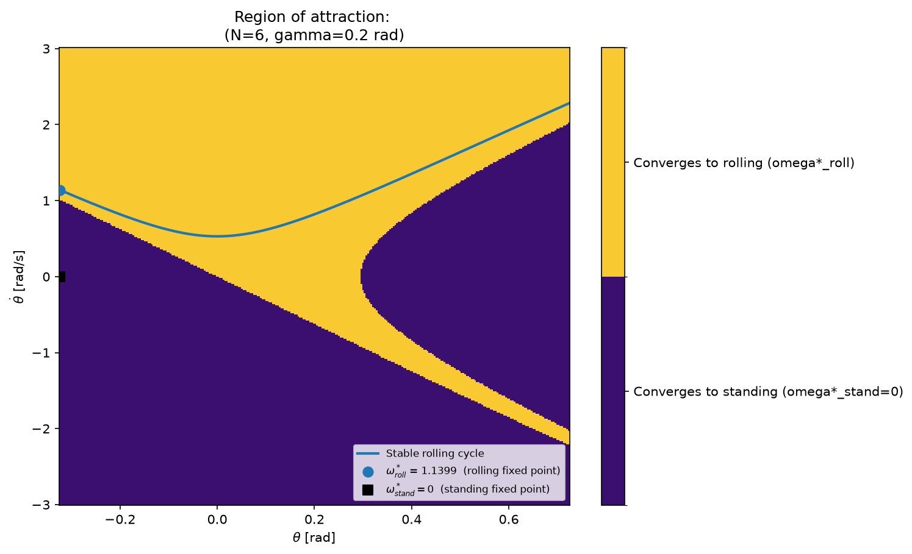
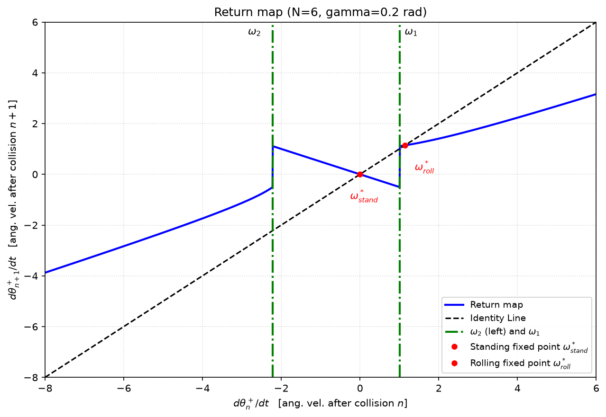
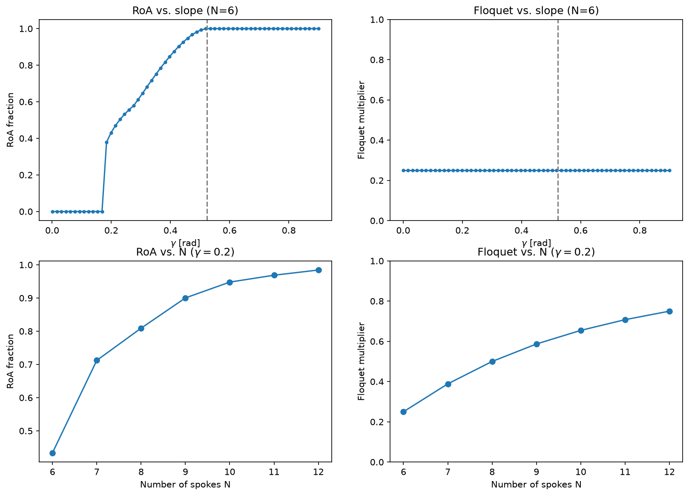

Assignment 1
\
Thomas Istvan (ti237)
\
09/04/2026

Modeling the Rimless Wheel:
\
Before any code implementation or mathematical analysis, I can imagine from the passive dynamic walker, the rimless wheel is highly sensitive to its inital conditions. If we have too little energy, then the wheel can not complete the step and if we have an appropriate amount it should enter some periodic cycle. Additionally, I would imagine that if it lacks the amount of energy needed to move forward, it will roll backwards and then oscillate until it reaches some equilibrium. Thus, there is some region of initial conditions that can produce a stable walking-gait cycle.

Since the rimless wheel model has very similar dynamics to the inverse pendulum I would expect to see a the dynamics of the system evolve based on the equation $\ddot{\theta} = (g/l)\sin{\theta}$. Given that the state vector is $x = [\theta, \dot{\theta}]$. If we linearize the dynamics about $(\theta, \dot{\theta}) = (0,0)$, we get $$\dot{x} = \begin{bmatrix} 0 & 1 \\ g/l & 0 \end{bmatrix}$$, thus the eigen values are $\lambda = \pm\sqrt{g/l}$,
indicating $\theta = 0$ is an unstable equilibrum because one of its eigen values is positive. Physically this means there is an equilibrium point $\theta = 0$ and it can remain here, but any small disturbance can cause it to move away from that equilibrium.

\
Sanity Check before:
- The ratio of kinetic energy after and before the collision should be $(KE^+/KE^-) =\cos^2({2\alpha})$, thus the angular velocity after impact should be smaller than before the impact. Using a $\alpha = 0.5236$ we should expect $(KE^+/KE^-) = 0.25$.
- Since the collison is plastic we would also see that the kinetic energy of the system should decrease after each collision.
- During continuous portion of each swing phase, the total mechanical energy should remain constant because there is no damping.
- After each swing, we should see a coordinate shift of ${\theta^+} = {\theta^-} - 2{\alpha}$.

Sanity Check after:
- Checking the pre and the post impact kinetic energy we can see a consistent ratio 0.250, which matches $\cos^2({2\alpha})$, with alpha being 0.5236 radians.
- Initally, before the system is in a stable-walking gait, the energy decreased in a staircase like behavior after each plastic collisiton. However, eventually it converges once the system reached a stable cycle. This was because gravity added energy into the system and was equivalent to the energy lost from the plastic collision.
- The angular velocity also converges to a constant value after several steps, which indicates that the system was converging to a periodic limit cycle.
- Double checking the state before and after each swing, we can see ${\theta}$ being updated as, ${\theta^+} = {\theta^-} - 2{\alpha}$.

Region of Attraction Plot:
- I would expect two attractors. Initial conditions with sufficient energy converge to a stable walking limit cycle. Where lower-energy initial conditions can reverse direction and oscillate between neighboring spokes and then come to rest in a standing position. Since each plastic plastic collision dissipates kinetic energy, the system will oscillate until the wheel approaches the unstable equilibrium. Thus, the walking gait and the resting state are two different attractors. The resting mode is a hybrid model itself because the equilibrium at $\theta = 0$ is unstable.
\

- For reducing computational time of the RoA, rather than directly integrating each ODE for each inital conditions. I used the conservation of energy for each continuous swing phase:

$$U_1 + K_1 = U_2 + K_2$$

$$(mgl)\cos(\theta_1) + \frac{1}{2}ml^2\dot{\theta}_1^2 = (mgl)\cos(\theta_2) + \frac{1}{2}ml^2\dot{\theta}_2^2$$

Dividing by $ml^2$ and isolating for $\dot{\theta}_2^2$ yields:

$$\dot{\theta}_2^2 = \dot{\theta}_1^2 + 2\left(\frac{g}{l}\right)(\cos(\theta_1) - \cos(\theta_2))$$

Where $\theta_1$ and $\theta_2$ are the arbitrary initial angle and final contact angle respectively.

\
Poincare Section:
- As shown below is my poincare section with the return map in blue, fixed points marked in red, my identity line in black, the minimum velocities in green.

Floquet Multiplier:
- To calculate the Floquet multiplier a central slope formula is used as it is more accurate compared to forward or backward difference formulas because it cancels out the first order error terms by evaluating both sides as opposed to only one which cancels the zeroth-order term of the Taylor expansion. 
$$f'(x) \approx \frac{f(x+\epsilon) - f(x-\epsilon)}{2\epsilon}$$

Numerical sweep of ${\gamma}$ and Num_spokes:
- Increasing the slope angle ${\gamma}$ increases the amount of gravitational energy per step , which can increase the size of the RoA because walking convergence can be produced from a larger range of initial conditions. A larger ${\gamma}$ allows gravity to provide more energy during each swing and makes it easier for the wheel to pass through the unstable vertical configuration. Thus, smaller inital conditions can still succesfully converge to the walking cycle with a larger ${\gamma}$.
- However, Increasing the slope does not increase the Floquet Multiplier because the return map is equal to $cos^2(2\alpha)$, where $\alpha = pi/num_{spokes}$. Thus, any increase in the slope angle ${\gamma}$ should not increase the floquet multiplier because it only affects the local stability of the walking cycle, rather than the local convergence rate around the walking attractor.
- An increase in number of spokes causes the RoA to get larger because the model has to travel less distance per step ($2\alpha$). The energy lost at impact also decreases since $(KE^+/KE^-) =\cos^2({2\alpha})$. Thus, allowing for higher convergence rates for smaller intial conditions compared to a less amount of spokes.
- As we increase N we can see that the floquet multiplier approaches a value closer to 1, thus affecting the rate at which the system converges. Since there is less energy dissipation we can see the system have a longer walking period compared to smaller values of N and converge relatively faster.

References
- https://underactuated.mit.edu/simple_legs.html#section2 

